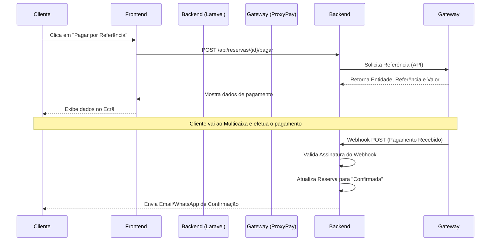
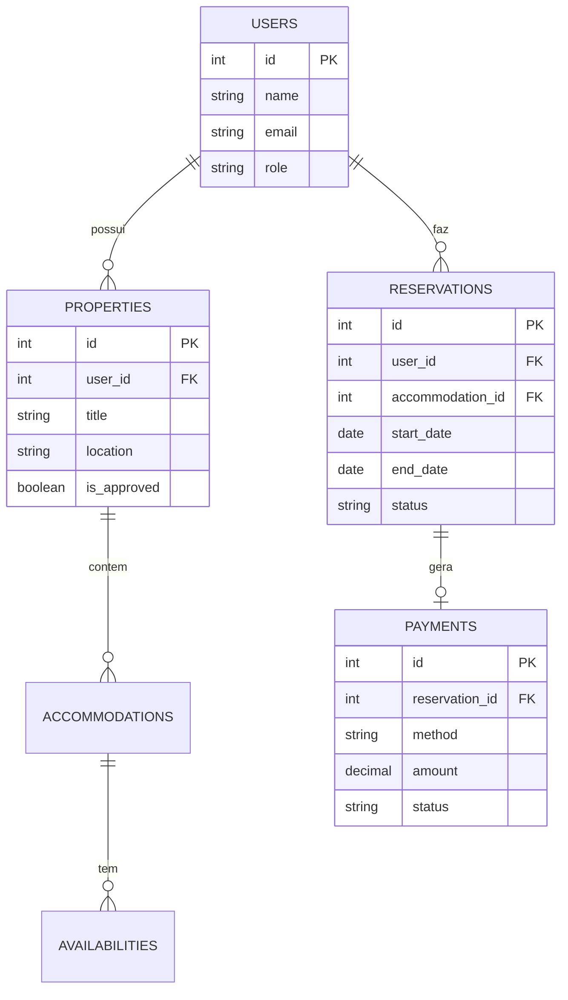

# AngolaStay - Documento de Arquitetura e Negócio
**Plataforma Angolana de Reservas de Alojamento e Serviços Turísticos**

---

## 1. Visão Geral e Modelo de Negócios

A **AngolaStay** é uma plataforma digital inovadora (estilo Airbnb/Booking) desenhada especificamente para a realidade do mercado angolano. O sistema conecta proprietários de imóveis (anfitriões) a clientes à procura de alojamento de curta duração, integrando métodos de pagamento locais e considerando as limitações de infraestrutura do país.

### Oportunidade de Mercado
* Centralização da oferta de alojamento turístico e executivo em Angola.
* Adaptação a métodos de pagamento locais (Multicaixa Express, Referência, Transferência).
* Plataforma otimizada para conexões de rede instáveis.

### Modelo de Receita
* **Comissão por Reserva:** Uma percentagem configurável cobrada ao proprietário sobre o valor total da reserva, descontada automaticamente ou cobrada no faturamento.
* **Escalabilidade:** Pronto para expansão em Serviços Turísticos adicionais (experiências, transporte).

---

## 2. Requisitos do Sistema

### Requisitos Funcionais
1. **Gestão de Utilizadores:** Autenticação e perfis para Clientes, Proprietários e Administradores.
2. **Gestão de Propriedades:** Cadastro de imóveis com fotos, capacidades, facilidades e preços. Aprovação prévia por um Admin.
3. **Motor de Pesquisa e Filtros:** Pesquisa por localização (Província, Município), datas, preço e capacidade.
4. **Sistema de Reservas:** Bloqueio instantâneo de datas (prevenção de *double-booking*).
5. **Integração de Pagamentos:** Suporte a Referência Multicaixa, Widget GPO (Iframe) e Transferência Bancária Manual com validação de comprovativo.
6. **Painel de Controlo (Dashboard):** Visão de métricas e gestão para Proprietários e Administradores.

### Requisitos Não Funcionais
1. **Segurança:** Autenticação baseada em tokens (Sanctum), proteção contra ataques CSRF/XSS, validação rígida de uploads (anti-vírus para comprovativos).
2. **Performance:** Respostas rápidas da API usando Redis para cache; imagens servidas via CDN; prevenção de queries N+1.
3. **Escalabilidade Horizontal:** API *stateless* desenhada para permitir múltiplos servidores em simultâneo (Load Balancing).
4. **Resiliência:** Operação Offline-first parcial (PWA) e transações seguras.

---

## 3. Engenharia de Software e Stack Tecnológico

A arquitetura do sistema foi desenhada com base numa separação clara entre Frontend (Cliente) e Backend (Servidor), utilizando as tecnologias mais modernas e robustas do mercado.

### Frontend Web (Client-Side)
* **Framework:** React + TypeScript + Vite.
* **UI/UX:** Tailwind CSS + shadcn/ui.
* **Gestão de Estado:** Zustand (Estado Global) e TanStack Query (Estado do Servidor/Cache).
* **Validação:** React Hook Form + Zod.
* **Resiliência:** vite-plugin-pwa (Acesso offline leve para redes instáveis).

### Backend API (Server-Side)
* **Framework:** Laravel 11/12 (PHP 8.3+).
* **Autenticação:** Laravel Sanctum (Tokens API).
* **Filas/Background Jobs:** Laravel Horizon (Processamento de pagamentos, emails e imagens).
* **Base de Dados:** PostgreSQL (Relacional) com suporte a PostGIS (Geolocalização).
* **Cache & Sessão:** Redis.

### Infraestrutura & DevOps
* **Containerização:** Docker e Docker Compose.
* **Armazenamento:** Cloudflare R2 + CDN (Imagens em alta velocidade).
* **Monitorização:** Sentry (Rastreamento de erros em tempo real).
* **Ambiente de Produção:** Deploy automatizado (Railway/AWS) via GitHub Actions.

---

## 4. Descrição dos Módulos

### Módulo 1: Autenticação e Autorização
Gere o ciclo de vida do utilizador, desde o registo, login, até a recuperação de senhas. Implementa RBAC (Role-Based Access Control) garantindo que Proprietários não acedem a dados de outros proprietários.

### Módulo 2: Catálogo e Pesquisa
Responsável pela exibição e filtragem otimizada de imóveis. Utiliza índices compostos na base de dados para garantir respostas em milissegundos mesmo com milhares de registos.

### Módulo 3: Motor de Reservas
Módulo central que gere a disponibilidade. Utiliza constraints lógicas na base de dados (Exclusion Constraints do Postgres) para impossibilitar duas reservas simultâneas na mesma data.

### Módulo 4: Financeiro e Pagamentos
Gere o ciclo de vida do pagamento. Permite transições de estado (Pendente -> Confirmado -> Expirado) acionadas por Webhooks externos (ProxyPay/GPO) ou aprovação manual administrativa.

---

## 5. Diagramas UML

### 5.1 Diagrama de Casos de Uso
```mermaid
usecaseDiagram
    actor Cliente
    actor Proprietario
    actor Admin

    Cliente --> (Pesquisar Alojamento)
    Cliente --> (Fazer Reserva)
    Cliente --> (Pagar Reserva)
    
    Proprietario --> (Cadastrar Propriedade)
    Proprietario --> (Gerir Reservas Recebidas)
    
    Admin --> (Aprovar Propriedades)
    Admin --> (Validar Comprovativos Manuais)
    Admin --> (Gerir Utilizadores)
```

### 5.2 Fluxo de Pagamento (Referência Multicaixa)


### 5.3 Modelo Entidade-Relacionamento (Core)


---
*Documento gerado automaticamente para fins de apresentação técnica e negociação de implementação.*
